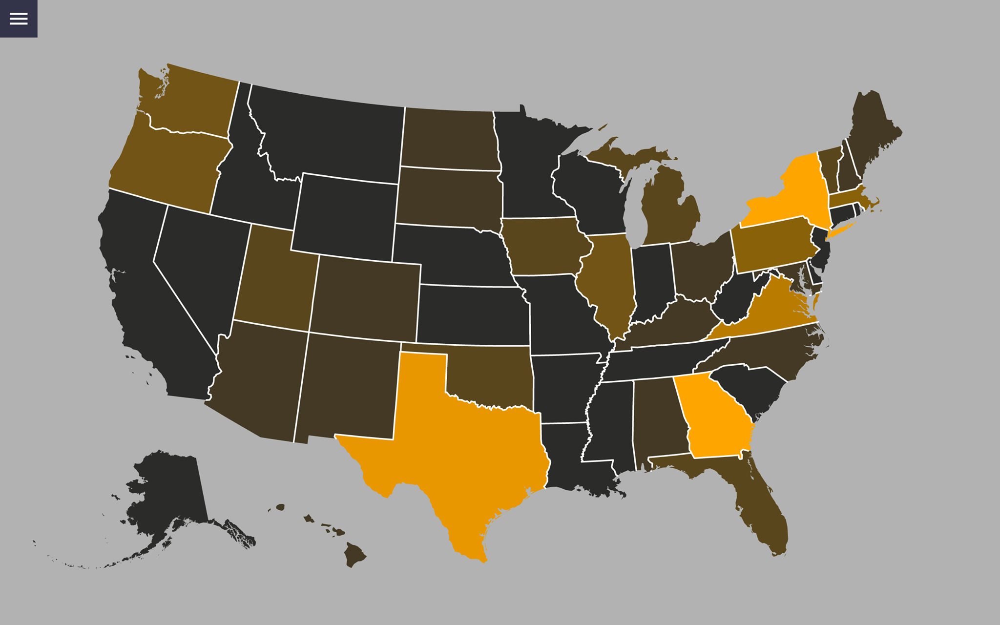
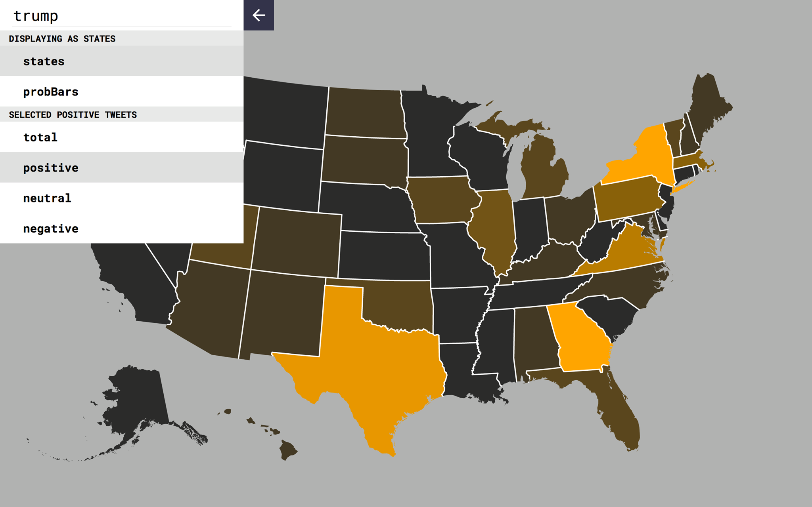

# Chirp
Twitter Sentimental Analysis Using Natural Language Processing Visualized on a Heatmap
Hack@Brown 2017

## Examples

## Inspiration
With the recent controversial political climate of America and the world, people's opinions on critical issues has never mattered more. We wanted to create something that can use machine learning and natural language processing to analyze people's opinions and visualize it.

## What it does
We used Twitter's API to fetch tweets according to any given keyword. These tweets were processed using natural language processing and sentiment analysis techniques and persisted in a database, or fetched from the database if previously queried. Using the metadata associated with these analyzed tweets, we used D3 to visualize the number of tweets and their semantic value across a map of the United States. This map is dynamically generated, with zoom functionality and a panel in which we can view tweets associated with a particular state.

## How we built it
We used Django as our web backend, running on a VM hosted by Microsoft Azure. Our REST API calls are routed through an Apache webserver and our database content is serialized and returned by the Django REST Framework. At the moment, our database is a SQLite3 database, but it is trivial to scale our database by switching to PostgreSQL sometime in the future. 

The frontend is written in D3 and Vue.js, with Gulp as our dependency manager. This makes simple fetch API calls to the backend and we can retrieve and query specific keywords according to the URL of the request. The JSON data retrieved by these calls is inserted into the javascript-based view layer, and rendered to the user. In order to embed properly styled tweets, we make another HTTP request to Twitter using the IDs of the analyzed tweets. 

In order to analyze these tweets we wrote a library, with calls to the TwitterAPI, that retrieve an abundance of tweets queried by a keyword, which we then run through an natural language processing API that returns the probability of positive/negative sentiments associated with the text of each tweet.

## Challenges we ran into
We experienced considerable challenges when attempting to decouple our frontend (client-side) fetch API calls from the backend. CORS was a problem in this case. Additionally, we found that a high proportion of the analyzed tweets have neutral sentiment. In the future, we hope that we can fine tune the sentiment analysis of the tweets to refine the results. We also had trouble finding accurate geolocation information for each tweet, and instead had to rely on the Google Geocode API to determine from which state each tweet originated. 

Finally, we encountered difficulties when dealing with Twitter's API rate limit. The solution to this was to restart the VM and change its IP. We hope to include more tweets with each API request in the future, perhaps by paying to raise the rate limit.

## Accomplishments that we're proud of
We designed our software stack and architecture very early on in the development process. Despite many challenges, restarts and merge conflicts we stuck to this architecture, and we each produced working components that subscribed to a standardized API, leading to effective iteration and seamless integration.

## What we learned
We learned a great deal about all the technologies used in developing this project, as well as how to navigate the pitfalls associated with using new technologies and other team's APIs. 

Since this was the first hackathon for all members of our team, our greatest learning experience came in the form of teamwork and collaboration.

## What's next for Chirp
We hope to maintain, refine and document the codebase. Perhaps most importantly, we hope to allow querying by temporal data as well as textual. It would be very cool to watch the sentiment of tweets shift over time (through election cycles, world events, etc.)
Since stock exchange depends heavily on the shifting public sentiments, this tool can be greatly used to aid the development of artificial intelligence stock analyzer.
